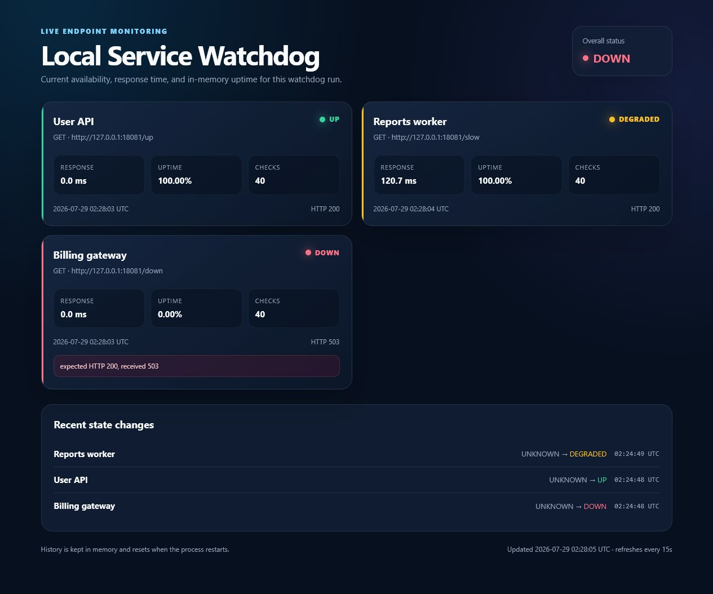
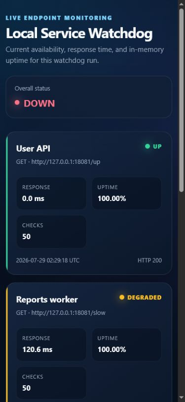
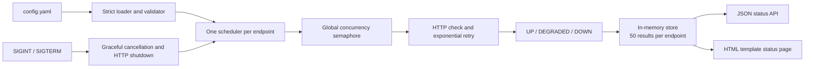

# Endpoint Watchdog

[](https://github.com/German4341374/endpoint-watchdog/actions/workflows/ci.yml)
[](https://go.dev/)
[](LICENSE)

Put the URLs you want to watch in a YAML file, start the service, and open the status page.
It checks each URL on a schedule and shows whether it's responding, how long it took,
and how often it has been available during this run.

It keeps the last 50 results per endpoint in memory. There's no database, so restarting
clears that history.

## Features

- Parallel endpoint schedules with a global concurrency limit.
- GET and HEAD checks with per-attempt timeout and custom headers.
- Expected HTTP status and optional response-text validation.
- `UP`, `DEGRADED`, `DOWN`, and initial `UNKNOWN` states.
- Exponential-backoff retry for failed checks.
- Response-time measurement and current-run uptime.
- Latest 50 final results and recent state transitions per endpoint.
- Structured JSON logs with no headers, query strings, or response bodies.
- Server-rendered, auto-refreshing status page.
- Graceful `SIGINT` and `SIGTERM` shutdown.
- Non-root multi-stage container with a health check.

## Status Page





The screenshots use local test endpoints representing `UP`, `DEGRADED`, and `DOWN` states.

Reproduce the screenshot data without external services:

```bash
go run ./cmd/demo-targets
# In a second terminal:
go run ./cmd/watchdog -config config.demo.yaml
```

## Configuration

Copy the safe local example:

```bash
cp config.example.yaml config.yaml
```

```yaml
server:
  address: ":8080"
  title: "Support Services"
  maxConcurrent: 4
  degradedThreshold: 500ms

retry:
  attempts: 3
  initialBackoff: 200ms

endpoints:
  - name: "Public API"
    url: "https://api.example.test/health"
    method: "GET"
    expectedStatus: 200
    timeout: 3s
    interval: 30s
    expectedText: '"status":"ok"'
    headers:
      Accept: "application/json"
```

Unknown fields, duplicate names, invalid durations, embedded URL credentials, and schemes other
than HTTP/HTTPS fail validation. Only GET and HEAD are allowed to prevent accidental mutations.
See [the full configuration reference](docs/configuration.md).

## Architecture



```text
cmd/watchdog/       process wiring, signals, and HTTP listener
internal/config/    strict YAML decoding, defaults, and validation
internal/monitor/   checks, retries, concurrency, state, uptime, and history
internal/web/       HTTP handlers, JSON API, middleware, and embedded template
```

## Run with Go

[Go 1.26.5](https://go.dev/dl/) or a compatible patch release is recommended.

```bash
go mod download
cp config.example.yaml config.yaml
go run ./cmd/watchdog -config config.yaml
```

Open <http://localhost:8080>. Stop with `Ctrl+C`; shutdown is logged as structured JSON.

Build a standalone binary:

```bash
go build -trimpath -o bin/endpoint-watchdog ./cmd/watchdog
./bin/endpoint-watchdog -config config.yaml
```

## Run with Docker

```bash
docker build -t endpoint-watchdog:local .
docker run --rm \
  --name endpoint-watchdog \
  --publish 8080:8080 \
  --volume "$PWD/config.yaml:/app/config.yaml:ro" \
  endpoint-watchdog:local
```

The image is built with Go 1.26.5, runs as UID/GID `10001`, and includes a Docker health check.
When monitoring services on the host from Docker Desktop, use `host.docker.internal` rather than
`127.0.0.1`.

## API

| Endpoint | Purpose |
| --- | --- |
| `GET /health` | Process liveness and Docker health check |
| `GET /api/status` | Overall state and compact endpoint summaries |
| `GET /api/status/:name` | One endpoint with history and transitions |
| `GET /` | HTML status page |

```bash
curl -s http://localhost:8080/health
curl -s http://localhost:8080/api/status
curl -s "http://localhost:8080/api/status/Watchdog%20health"
```

Example:

```json
{
  "service": "Endpoint Watchdog",
  "state": "UP",
  "endpoints": [
    {
      "name": "Watchdog health",
      "state": "UP",
      "responseTimeMs": 1.42,
      "uptimePercent": 100,
      "checks": 4
    }
  ]
}
```

The API removes URL query strings and never exposes configured headers.

## Development

```bash
make setup
make fmt-check
make vet
make test
make build
make docker-build
```

Equivalent commands:

```bash
test -z "$(gofmt -l .)"
go vet ./...
go test -race -cover ./...
go build ./cmd/watchdog
```

Tests cover configuration, state calculation, bounded history, concurrency, retries, handlers,
and fake HTTP servers for success, failure, slow responses, and timeouts.

## Security Limitations

- Configuration is trusted operator input. Allowing an untrusted user to edit endpoint URLs
  creates an SSRF path to private network services.
- The service has no authentication or TLS. Keep it on a private network or use an authenticated
  TLS reverse proxy.
- A successful check may read up to 1 MiB when `expectedText` is configured.
- Custom headers may contain secrets. Protect `config.yaml` with filesystem permissions.
- In-memory history disappears on restart and is not suitable for audit requirements.
- Uptime measures only the current process run and is not long-term SLA evidence.
- The liveness endpoint reports process health, not whether every monitored target is available.

## Limitations

- No database, registration, user roles, or external notification integrations.
- No persistent metrics or cross-instance coordination.
- Intervals begin when the process starts and are not cron schedules.
- Redirects follow the standard Go client policy.

## License

Licensed under the [MIT License](LICENSE).
